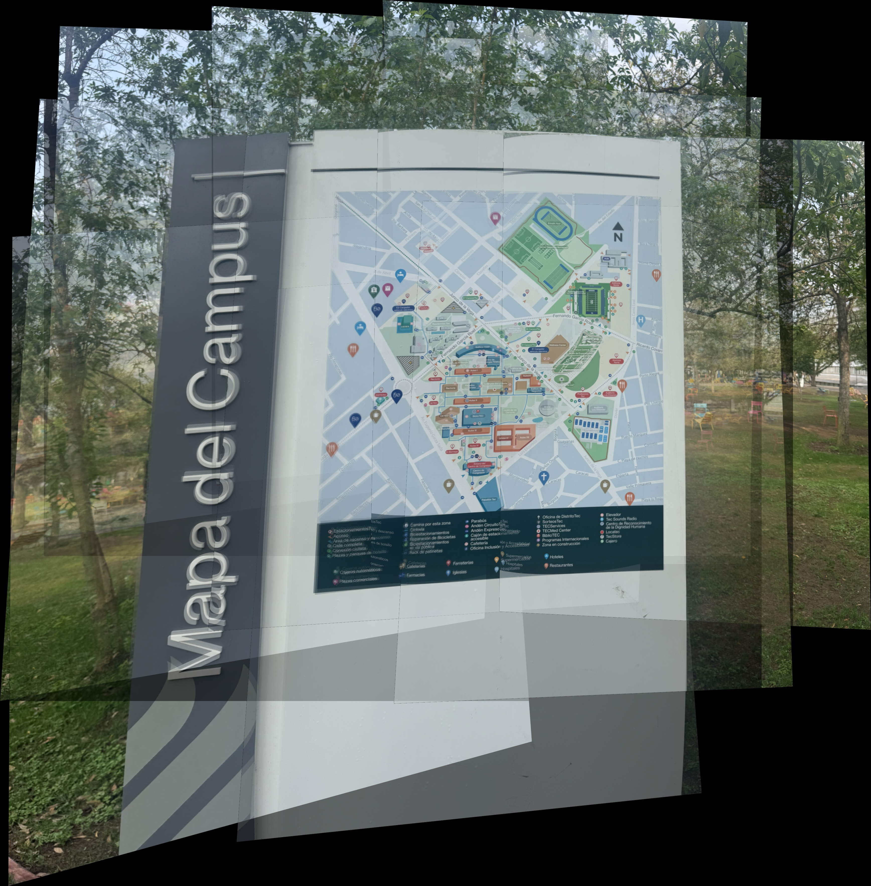
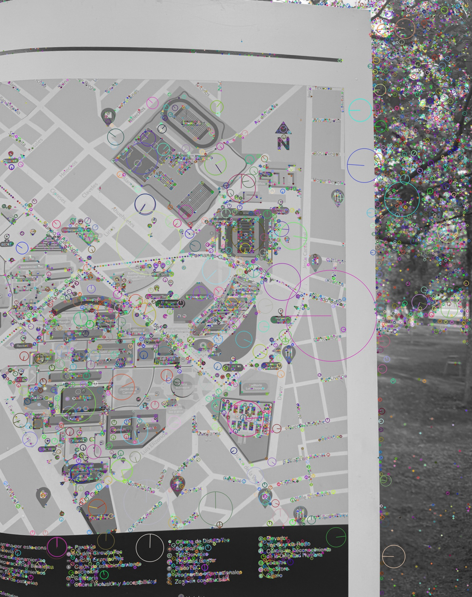
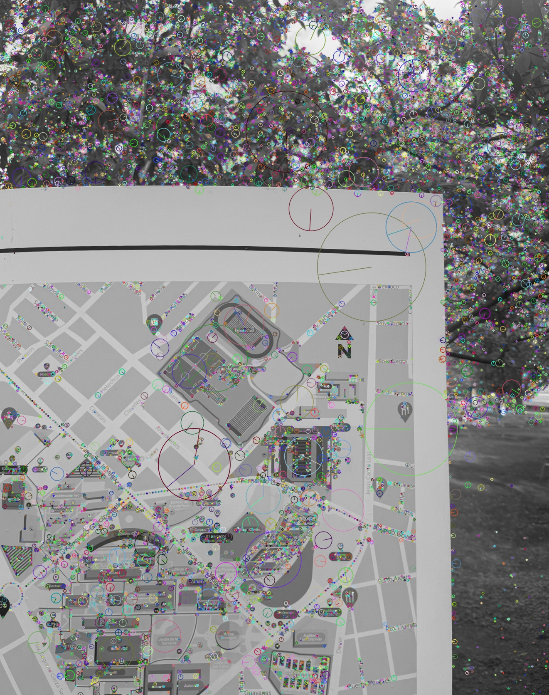
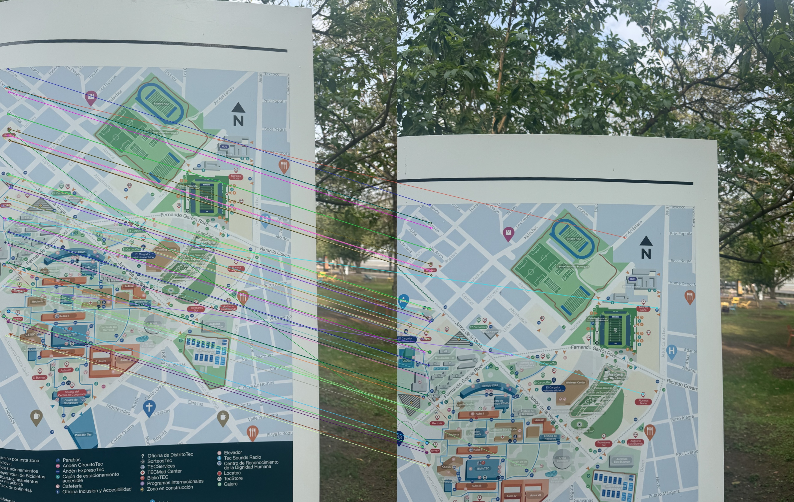
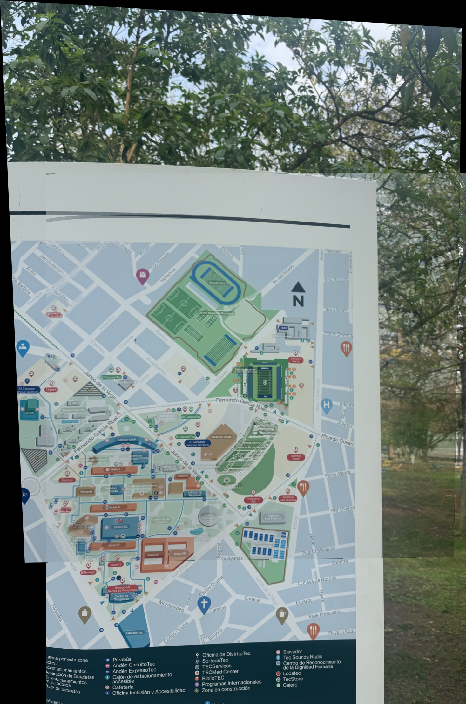
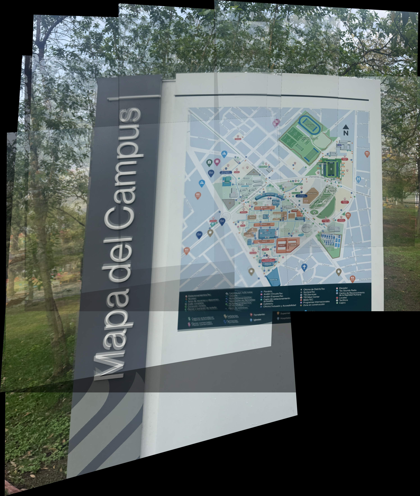

# Activity 3.3 — 2D Map with Photogrammetry

Top-down photos of a campus map sign (Tecnológico de Monterrey) were stitched together into a single **2D orthomosaic** using SIFT, FLANN, and RANSAC homography in Python + OpenCV.

---

## Final Result



> 11 overlapping images stitched — output: **3472 × 3530 px**

---

## Pipeline

```
Top-down photos
  → Camera Calibration   (Zhang's method, checkerboard)
  → Undistortion         (remove lens distortion)
  → SIFT                 (keypoints + 128-D descriptors)
  → FLANN + ratio test   (feature matching)
  → RANSAC               (homography estimation)
  → Warp + Stitch        → 2D Orthomosaic Map
```

---

## Visualizations

### SIFT Keypoints

| Accumulated map | Incoming image |
|:---:|:---:|
|  |  |

### Feature Matches



### Stitching Progress

| Step 1 | Step 5 | Step 10 |
|:---:|:---:|:---:|
|  |  |  |

---

## Run Results

| Step | Canvas size | SIFT kps | Good matches | RANSAC inliers |
|:---:|:---:|:---:|:---:|:---:|
| 1 | 1467 × 2215 | 16 915 | 3 336 | 2 701 |
| 2 | 2148 × 2215 | 13 951 | 2 463 | 1 808 |
| 3 | 2817 × 2215 | 12 997 | 1 135 | 445 |
| 4 | 2992 × 2793 | 10 607 | 1 570 | 742 |
| 5 | 2992 × 3530 | 9 871 | 1 716 | 850 |
| 6 | 2992 × 3530 | 6 583 | 2 783 | 2 240 |
| 7 | 2992 × 3530 | 9 633 | 2 914 | 2 365 |
| 8 | 3036 × 3530 | 14 740 | 2 947 | 2 300 |
| 9 | 3161 × 3530 | 12 488 | 3 115 | 2 553 |
| 10 | **3472 × 3530** | 17 233 | 2 064 | 1 368 |

---

## Usage

```bash
# Install dependencies
pip install opencv-python numpy pillow pillow-heif

# Calibrate camera (place checkerboard photos in calib_images/)
python3 repo/calibrate_camera.py

# Run the pipeline
python3 repo/drone_map_pipeline.py --folder map_tec --params camera_params.npz
```

---

## Files

| File | Description |
|---|---|
| `repo/calibrate_camera.py` | Camera calibration (Zhang's method) |
| `repo/drone_map_pipeline.py` | Full pipeline: undistort → SIFT → FLANN → RANSAC → stitch |
| `camera_params.npz` | Intrinsic matrix K + distortion coefficients |
| `map_tec_result.jpg` | Final 2D orthomosaic map |
| `calib_images/` | Checkerboard photos for calibration |
| `map_tec/` | Input drone images |
